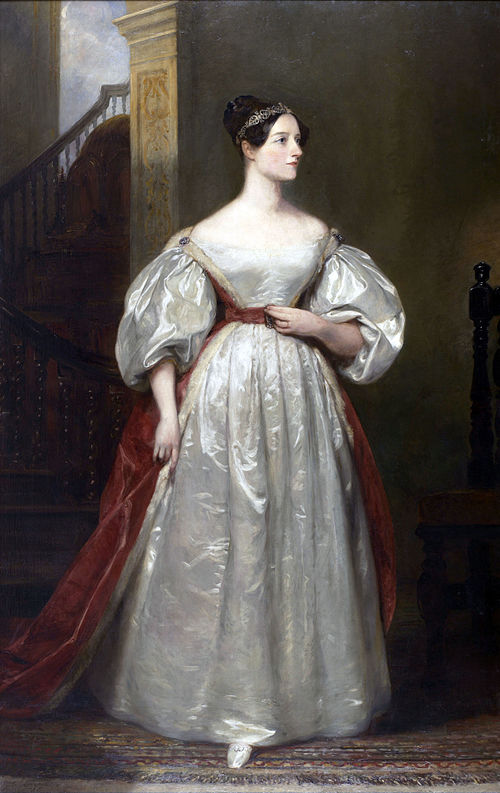

# Ada Lovelace: A Primeira Programadora da História 💫

## 👑 Quem foi Ada Lovelace?

**Augusta Ada King, Condessa de Lovelace** (1815-1852) foi uma matemática e escritora britânica visionária, reconhecida como a primeira programadora da história. Conhecida como "A Feiticeira dos Números", ela previu que máquinas poderiam ir além de meros cálculos e criar música, arte e ciência.

---

## 📚 Linha do Tempo

### 🎓 Educação e Primeiros Anos
- **1815**: Nasceu em Londres, filha do poeta Lord Byron
- **1828**: Desenvolveu interesse por matemática e tecnologia
- **1833**: Conheceu Charles Babbage, pai do computador
- **1842**: Traduziu e ampliou o artigo sobre a Máquina Analítica

### 🔬 Parceria com Babbage
- **1833**: Iniciou colaboração com Charles Babbage
- **1842**: Traduziu artigo do italiano Luigi Menabrea
- **1843**: Publicou suas "Notas" revolucionárias
- **1852**: Faleceu aos 36 anos de câncer uterino

---

## 💡 Contribuições Revolucionárias

### 🔧 Máquina Analítica
- Previu o potencial da máquina de Babbage além de cálculos numéricos
- Descreveu como poderia processar símbolos e criar música/arte
- Estabeleceu os fundamentos da computação moderna

### 📝 Primeiro Algoritmo
- **1843**: Criou o primeiro algoritmo para ser processado por uma máquina
- Desenvolveu um método para calcular números de Bernoulli
- Seu trabalho é considerado o primeiro programa de computador

### 🔮 Visão do Futuro
- Previu que máquinas poderiam compor música complexa
- Antecipou a inteligência artificial e criatividade computacional
- Concebeu a ideia de loops e sub-rotinas na programação

### 🧠 Abordagem Científica
- Diferenciou dados de processamento
- Estabeleceu conceitos de arquitetura de computadores
- Desenvolveu metodologia para programação

*Diagrama da Máquina Analítica que Ada estudou e expandiu*

---

## 🏆 Reconhecimentos Póstumos

| Reconhecimento | Ano | Significado |
|----------------|-----|-------------|
| **Linguagem ADA** | 1980 | Linguagem de programação nomeada em sua homenagem |
| **Dia da Ada Lovelace** | 2009 | Celebrado na segunda terça de outubro |
| **Google Doodle** | 2012 | Homenagem no seu 197º aniversário |
| **Prêmio Lovelace** | 1998 | Premiação britânica para mulheres em TI |

---

## 🎯 Filosofia e Citações Inspiradoras

> "A Máquina Analítica tece padrões algébricos assim como o tear de Jacquard tece flores e folhas."

> "A imaginação é a faculdade da descoberta, eminentemente. É o que penetra nos mundos nunca vistos ao nosso redor, nos mundos da ciência."

> "Este mecanismo pode agir sobre outras coisas além do número... poderia compor peças musicais elaboradas e científicas de qualquer grau de complexidade."

---

## 📚 Legado e Influência

### 💻 Mulheres na Tecnologia
- Ícone e inspiração para mulheres em STEM
- Simboliza a presença feminina desde os primórdios da computação
- Nome presente em diversas iniciativas de inclusão de gênero

### 🎓 Educação
- Seu trabalho inspirou gerações de cientistas da computação
- Método de pensamento analítico ainda relevante
- Visão interdisciplinar entre artes e ciências

### 🌍 Impacto Moderno
- Considerada profeta da era digital
- Seus conceitos fundamentam a computação moderna
- Inspiração para pesquisas em IA e criatividade computacional

---

## 🏛️ Museus e Homenagens

### 🎪 Locais de Destaque
- **British Library** - Londres: Guarda seus documentos originais
- **Science Museum** - Londres: Exposição permanente
- **Computer History Museum** - California: Tributo especial

### 📜 Prêmios e Medalhas
- **Medalha Ada Lovelace** - Associação Britânica de Computação
- **Prêmio Ada Lovelace** - Women in Technology International
- **Bolsa Ada Lovelace** - Para mulheres em computação

---

## 📖 Para Saber Mais

### 📚 Leitura Recomendada
- "Ada's Algorithm" - James Essinger
- "The Bride of Science" - Benjamin Woolley
- "Ada Lovelace: The Making of a Computer Scientist" - Christopher Hollings

### 🌐 Recursos Online
- [Ada Lovelace - Biography](https://www.biography.com/scientist/ada-lovelace)
- [Computer History Museum](https://computerhistory.org/babbage/adalovelace/)
- [Ada Lovelace Day](https://findingada.com)

---

## 🎉 Conclusão

Ada Lovelace não foi apenas uma matemática excepcional, mas uma visionária que enxergou o potencial dos computadores um século antes de sua realização prática. Seu legado transcende a programação, inspirando a união entre tecnologia, arte e humanidade.

> "Quanto mais estudo, mais sinto que minha mente não é nada além de algo incompleto."

---

*"A Feiticeira dos Números" - 1815-1852* ✨🔢💻

---
*Última atualização: Dezembro 2024*

