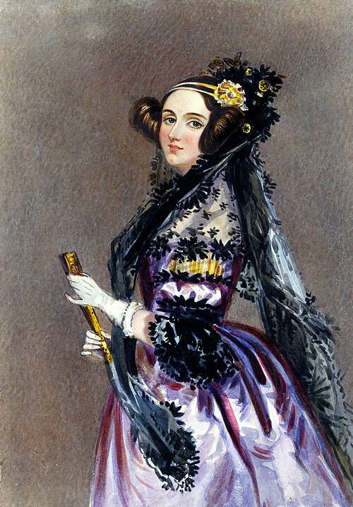
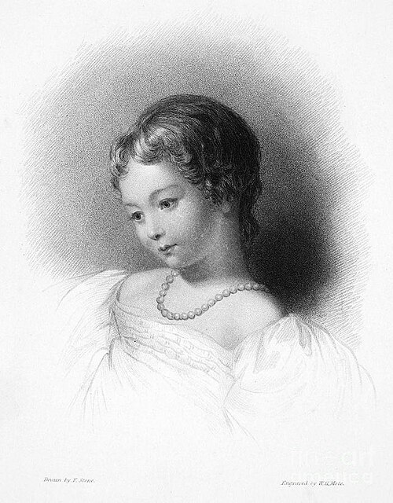
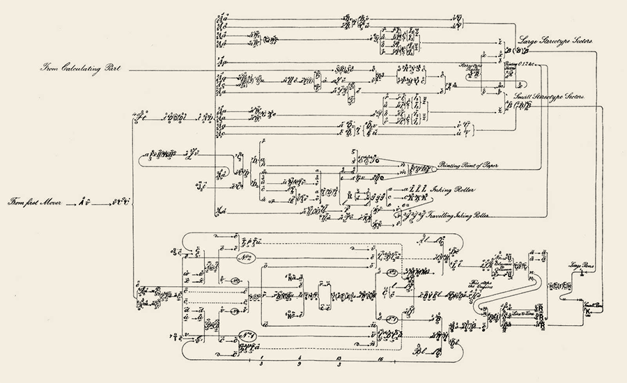
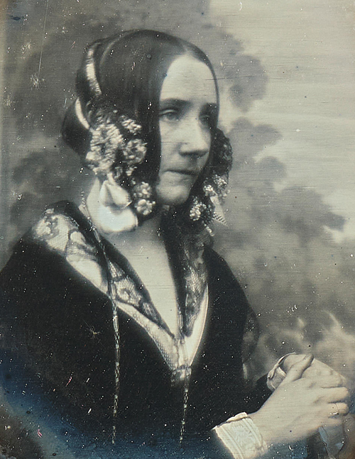

# Ada Lovelace: A Primeira Programadora da História 💫

## 👑 Quem foi Ada Lovelace?

**Augusta Ada King, Condessa de Lovelace** (1815-1852) foi uma matemática e escritora britânica visionária, reconhecida como a primeira programadora da história. Conhecida como "A Feiticeira dos Números", ela previu que máquinas poderiam ir além de meros cálculos e criar música, arte e ciência.

---

## 📚 Linha do Tempo

### 🎓 Educação e Primeiros Anos
- **1815**: Nasceu em Londres, filha do poeta Lord Byron
- **1828**: Desenvolveu interesse por matemática e tecnologia
- **1833**: Conheceu Charles Babbage, pai do computador
- **1842**: Traduziu e ampliou o artigo sobre a Máquina Analítica

### 🔬 Parceria com Babbage
- **1833**: Iniciou colaboração com Charles Babbage
- **1842**: Traduziu artigo do italiano Luigi Menabrea
- **1843**: Publicou suas "Notas" revolucionárias
- **1852**: Faleceu aos 36 anos de câncer uterino

---

## 💡 Contribuições Revolucionárias

### 🔧 Máquina Analítica
- Previu o potencial da máquina de Babbage além de cálculos numéricos
- Descreveu como poderia processar símbolos e criar música/arte
- Estabeleceu os fundamentos da computação moderna

### 📝 Primeiro Algoritmo
- **1843**: Criou o primeiro algoritmo para ser processado por uma máquina
- Desenvolveu um método para calcular números de Bernoulli
- Seu trabalho é considerado o primeiro programa de computador

### 🔮 Visão do Futuro
- Previu que máquinas poderiam compor música complexa
- Antecipou a inteligência artificial e criatividade computacional
- Concebeu a ideia de loops e sub-rotinas na programação

### 🧠 Abordagem Científica
- Diferenciou dados de processamento
- Estabeleceu conceitos de arquitetura de computadores
- Desenvolveu metodologia para programação

---

## 🏆 Reconhecimentos Póstumos

| Reconhecimento | Ano | Significado |
|----------------|-----|-------------|
| **Linguagem ADA** | 1980 | Linguagem de programação nomeada em sua homenagem |
| **Dia da Ada Lovelace** | 2009 | Celebrado na segunda terça de outubro |
| **Google Doodle** | 2012 | Homenagem no seu 197º aniversário |
| **Prêmio Lovelace** | 1998 | Premiação britânica para mulheres em TI |

---

*"A Feiticeira dos Números" - 1815-1852* ✨🔢💻

