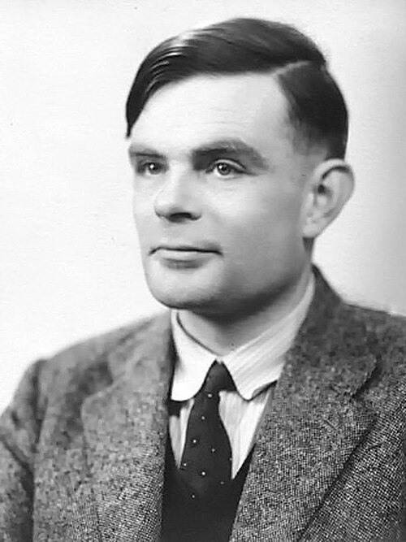
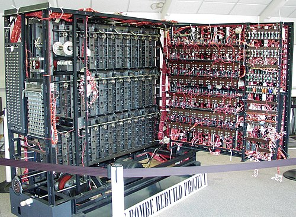

# Alan Turing: O Pai da Computação Moderna 🧠

## 🔬 Quem foi Alan Turing?

**Alan Mathison Turing** (1912-1954) foi um matemático, cientista da computação e criptoanalista britânico, amplamente considerado o pai da computação moderna e da inteligência artificial. Suas contribuições revolucionárias durante a Segunda Guerra Mundial e seus trabalhos teóricos moldaram o futuro da tecnologia.

---

## 📚 Linha do Tempo

### 🎓 Educação e Primeiros Anos
- **1912**: Nasceu em Londres, Inglaterra
- **1931**: Ingressou no King's College, Cambridge
- **1934**: Graduou-se com honras em Matemática
- **1938**: Obteve PhD em Princeton

### ⚔️ Segunda Guerra Mundial
- **1939**: Recrutado pelo Government Code and Cypher School
- **1939-1945**: Trabalhou em Bletchley Park decifrando códigos nazistas
- **1940**: Desenvolveu a Bombe para decifrar a máquina Enigma
- **1945**: Recebeu a Ordem do Império Britânico

---

## 💡 Contribuições Revolucionárias

### 🤖 Máquina de Turing
- **1936**: Publicou "On Computable Numbers"
- Estabeleceu os fundamentos teóricos da computação
- Conceituou a máquina universal capaz de executar qualquer algoritmo

### 🔒 Criptoanálise da Enigma
- Liderou a equipe que decifrou a máquina Enigma alemã
- Desenvolveu técnicas que encurtaram a guerra em 2-4 anos
- Salvou milhões de vidas com seu trabalho

### 🧠 Inteligência Artificial
- **1950**: Publicou "Computing Machinery and Intelligence"
- Propôs o Teste de Turing para inteligência artificial
- Estabeleceu bases filosóficas para a IA

### 💻 Computadores Modernos
- **1945**: Projetou o Automatic Computing Engine (ACE)
- Desenvolveu conceitos de programação armazenada
- Contribuiu para o Manchester Mark I

---

## 🏆 Reconhecimentos Póstumos

| Reconhecimento | Ano | Significado |
|----------------|-----|-------------|
| **Prêmio Turing** | 1966 | "Nobel da Computação" em sua homenagem |
| **Desculpa Oficial** | 2009 | Pedido de desculpas do governo britânico |
| **Perdão Real** | 2013 | Perdão concedido pela Rainha Elizabeth II |
| **Nota de £50** | 2021 | Sua imagem na cédula britânica |

---

*"O Pai da Computação" - 1912-1954* 🧠💻🔐

