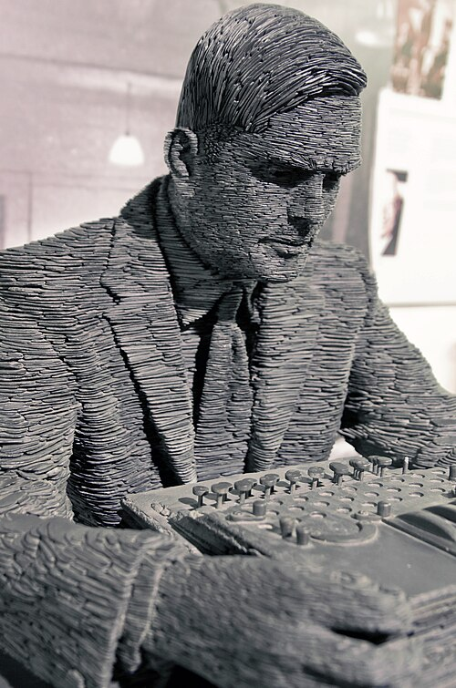
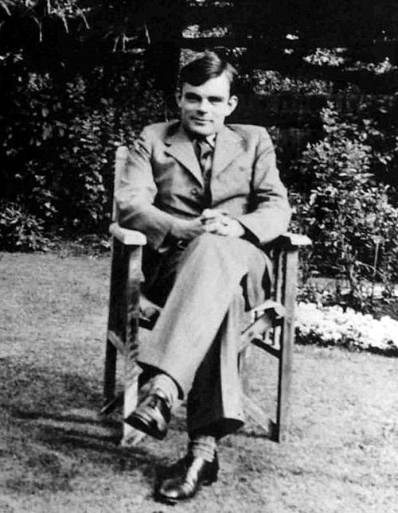

# Alan Turing: O Pai da Computação Moderna 🧠

## 🔬 Quem foi Alan Turing?

**Alan Mathison Turing** (1912-1954) foi um matemático, cientista da computação e criptoanalista britânico, amplamente considerado o pai da computação moderna e da inteligência artificial. Suas contribuições revolucionárias durante a Segunda Guerra Mundial e seus trabalhos teóricos moldaram o futuro da tecnologia.

---

## 📚 Linha do Tempo

### 🎓 Educação e Primeiros Anos
- **1912**: Nasceu em Londres, Inglaterra
- **1931**: Ingressou no King's College, Cambridge
- **1934**: Graduou-se com honras em Matemática
- **1938**: Obteve PhD em Princeton

### ⚔️ Segunda Guerra Mundial
- **1939**: Recrutado pelo Government Code and Cypher School
- **1939-1945**: Trabalhou em Bletchley Park decifrando códigos nazistas
- **1940**: Desenvolveu a Bombe para decifrar a máquina Enigma
- **1945**: Recebeu a Ordem do Império Britânico

---

## 💡 Contribuições Revolucionárias

### 🤖 Máquina de Turing
- **1936**: Publicou "On Computable Numbers"
- Estabeleceu os fundamentos teóricos da computação
- Conceituou a máquina universal capaz de executar qualquer algoritmo

### 🔒 Criptoanálise da Enigma
- Liderou a equipe que decifrou a máquina Enigma alemã
- Desenvolveu técnicas que encurtaram a guerra em 2-4 anos
- Salvou milhões de vidas com seu trabalho

### 🧠 Inteligência Artificial
- **1950**: Publicou "Computing Machinery and Intelligence"
- Propôs o Teste de Turing para inteligência artificial
- Estabeleceu bases filosóficas para a IA

### 💻 Computadores Modernos
- **1945**: Projetou o Automatic Computing Engine (ACE)
- Desenvolveu conceitos de programação armazenada
- Contribuiu para o Manchester Mark I

*Diagrama representando o conceito do Teste de Turing*

---

## 🏆 Reconhecimentos Póstumos

| Reconhecimento | Ano | Significado |
|----------------|-----|-------------|
| **Prêmio Turing** | 1966 | "Nobel da Computação" em sua homenagem |
| **Desculpa Oficial** | 2009 | Pedido de desculpas do governo britânico |
| **Perdão Real** | 2013 | Perdão concedido pela Rainha Elizabeth II |
| **Nota de £50** | 2021 | Sua imagem na cédula britânica |

---

## 🎯 Filosofia e Citações Inspiradoras

> "Às vezes, são as pessoas que ninguém espera nada que fazem as coisas que ninguém consegue imaginar."

> "Só podemos ver um pouco do futuro, mas o suficiente para perceber que há muito a fazer."

> "A ciência é uma equação diferencial. A religião é uma condição de contorno."

---

## 📚 Legado e Influência

### 💻 Ciência da Computação
- Fundações teóricas para todos os computadores modernos
- Conceito de algoritmo e computabilidade
- Arquitetura de von Neumann baseada em suas ideias

### 🔐 Segurança e Criptografia
- Pai da criptografia moderna
- Bases para segurança computacional
- Influência em protocolos de comunicação

### 🌍 Impacto Cultural
- Inspiração para filmes e documentários
- Símbolo da luta por direitos LGBTQ+
- Ícone da ciência britânica

---

## 🏛️ Museus e Homenagens

### 🎪 Locais de Destaque
- **Bletchley Park** - Museu da computação e criptografia
- **Science Museum** - Londres: Exposição permanente
- **Manchester University** - Estátua e centro de computação

### 📜 Prêmios e Medalhas
- **Prêmio Turing** - Maior honraria em ciência da computação
- **Alan Turing Institute** - Instituto de pesquisa em data science
- **Turing Award** - Concedido anualmente pela ACM

---

## 📖 Para Saber Mais

### 📚 Leitura Recomendada
- "Alan Turing: The Enigma" - Andrew Hodges
- "The Man Who Knew Too Much" - David Leavitt
- "Turing's Vision" - Chris Bernhardt

### 🌐 Recursos Online
- [The Alan Turing Institute](https://www.turing.ac.uk)
- [Bletchley Park](https://bletchleypark.org.uk)
- [Computer History Museum](https://computerhistory.org)

---

## 🎉 Conclusão

Alan Turing não foi apenas um gênio matemático, mas um visionário cujas ideias moldaram o mundo digital em que vivemos. Seu legado transcende a ciência, representando coragem, perseverança e a busca incansável pelo conhecimento.

> "Esperamos que as máquinas competam com os homens em todos os campos puramente intelectuais."

---

*"O Pai da Computação" - 1912-1954* 🧠💻🔐

---
*Última atualização: Dezembro 2024*

