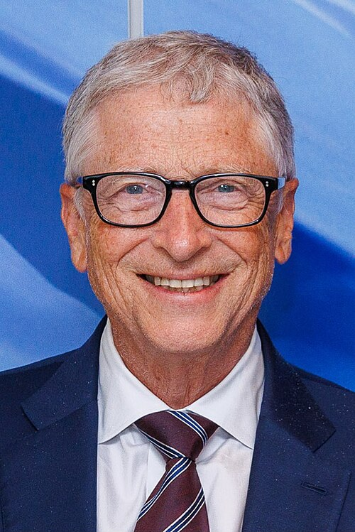
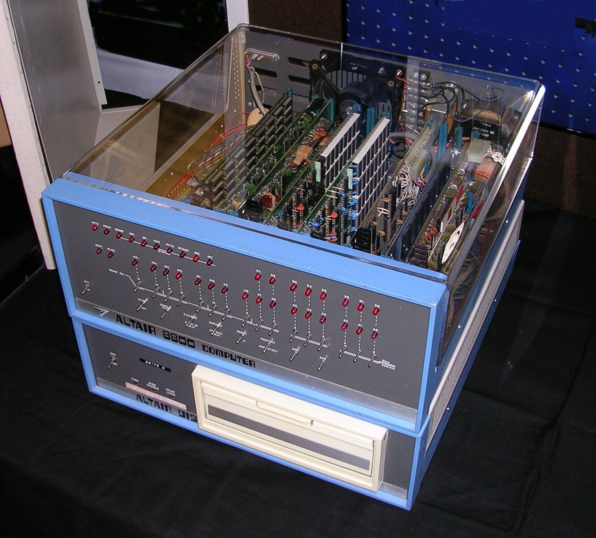
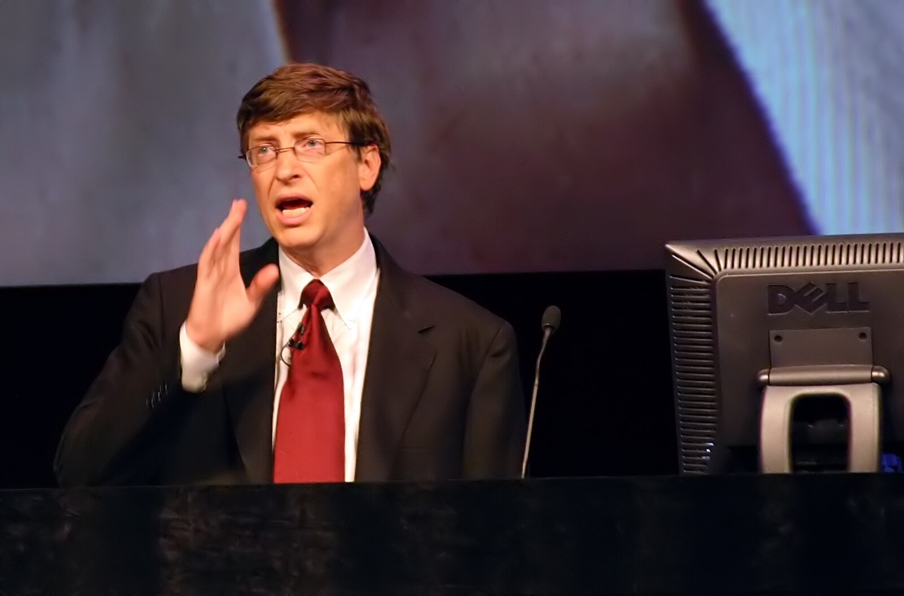

# Bill Gates: O Visionário da Computação Pessoal 💻

## 💼 Quem é Bill Gates?

**William Henry Gates III** (1955-presente) é um empresário, investidor, filantropo e autor americano, mais conhecido por cofundar a Microsoft Corporation, a maior empresa de software para computadores pessoais do mundo. Sua visão de "um computador em cada mesa e em cada casa" revolucionou a indústria de tecnologia.

---

## 📚 Linha do Tempo

### 🎓 Educação e Primeiros Anos
- **1955**: Nasceu em Seattle, Washington
- **1968**: Teve primeiro contato com computadores na Lakeside School
- **1973**: Entrou em Harvard University
- **1975**: Abandonou Harvard para fundar a Microsoft

### 🚀 Microsoft e Revolução Digital
- **1975**: Fundou a Microsoft com Paul Allen
- **1980**: Fechou contrato com IBM para sistema operacional
- **1985**: Lançamento do Windows 1.0
- **1995**: Windows 95 revoluciona interface do usuário

---

## 💡 Contribuições Revolucionárias

### ⚙️ Sistema Operacional Windows
- Popularizou a computação pessoal com interface gráfica
- Dominou o mercado de sistemas operacionais por décadas
- Criou padrões de usabilidade para computadores domésticos

### 📊 Microsoft Office
- Suite de produtividade que se tornou padrão corporativo
- Integrou Word, Excel e PowerPoint
- Revolucionou o trabalho de escritório

### 💰 Modelo de Negócios de Software
- Pioneiro no licenciamento de software
- Estabeleceu o modelo de negócios para indústria de software
- Criou ecossistema para desenvolvedores

### 🌐 Internet Explorer
- Integrou navegação web no Windows
- Popularizou o acesso à internet para milhões
- Dominou mercado de navegadores por anos

*Bill Gates no lançamento do Windows 95, um marco na computação pessoal*

---

## 🏆 Reconhecimentos e Conquistas

| Reconhecimento | Ano | Significado |
|----------------|-----|-------------|
| **Homem Mais Rico do Mundo** | 1995-2007 | Primeiro na lista da Forbes |
| **Medalha Presidencial da Liberdade** | 2016 | Maior honraria civil dos EUA |
| **Doutor Honoris Causa** | Várias | Harvard, Cambridge, entre outras |
| **Time 100** | Múltiplos | Lista das pessoas mais influentes |

---

## 🎯 Filosofia e Citações Inspiradoras

> "Sucesso é um professor péssimo. Ele convence pessoas inteligentes que elas não podem perder."

> "Medimos nosso sucesso pelo sucesso de nossos clientes."

> "A tecnologia é apenas uma ferramenta. Para motivar as crianças e fazê-las trabalhar juntas, o professor é o mais importante."

---

## 📚 Legado e Influência

### 💻 Revolução Digital
- Tornou computadores acessíveis para massa
- Criou padrões de indústria
- Impulsionou economia digital global

### 🏥 Filantropia
- **2000**: Fundou Bill & Melinda Gates Foundation
- Doou mais de $50 bilhões para causas globais
- Foco em saúde global e educação

### 🌍 Impacto Global
- Modelo para empreendedores de tecnologia
- Influência em políticas de saúde e educação
- Advocacy por energia limpa e inovação

---

## 🏛️ Fundação e Trabalho Filantrópico

### 🎪 Áreas de Atuação
- **Saúde Global**: Combate à malária, polio, HIV
- **Educação**: Reforma educacional nos EUA
- **Pobreza**: Desenvolvimento agrícola e econômico
- **Energia**: Investimento em energia limpa

### 📜 Realizações Notáveis
- **GAVI**: Aliança global para vacinas
- **The Giving Pledge**: Compromisso de doação de bilionários
- **Breakthrough Energy**: Investimento em energia limpa

---

## 📖 Para Saber Mais

### 📚 Leitura Recomendada
- "The Road Ahead" - Bill Gates
- "Business @ the Speed of Thought" - Bill Gates
- "Gates: How Microsoft's Mogul Reinvented an Industry" - Stephen Manes

### 🌐 Recursos Online
- [Gates Notes](https://www.gatesnotes.com)
- [Bill & Melinda Gates Foundation](https://www.gatesfoundation.org)
- [Microsoft History](https://www.microsoft.com/en-us/about)

---

## 🎉 Conclusão

Bill Gates transformou não apenas a indústria de tecnologia, mas também redefiniu o papel dos bilionários na sociedade através de sua filantropia inovadora. Sua jornada de programador visionário a filantropo global continua inspirando gerações.

> "Acredito que se você mostrar às pessoas os problemas e mostrar a elas as soluções, elas serão movidas a agir."

---

*"O Visionário de Seattle" - 1955-presente* 💻🌍❤️

---
*Última atualização: Dezembro 2024*

