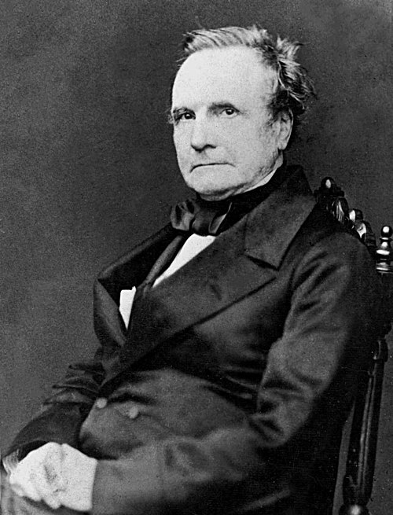
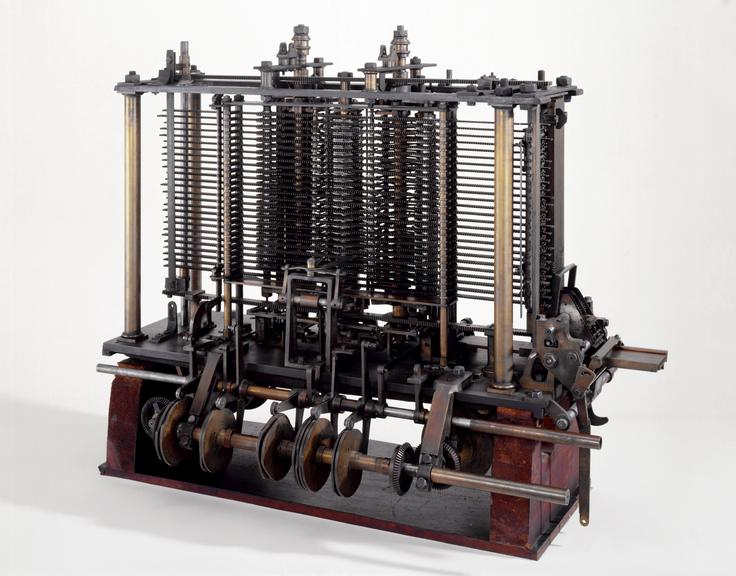

# Charles Babbage: O Pai do Computador 🔧

## 🎩 Quem foi Charles Babbage?

**Charles Babbage** (1791-1871) foi um matemático, filósofo, inventor e engenheiro mecânico inglês, amplamente considerado o "pai do computador". Suas invenções visionárias da Máquina Diferencial e da Máquina Analítica estabeleceram os fundamentos conceituais para a computação moderna mais de um século antes dos primeiros computadores eletrônicos.

---

## 📚 Linha do Tempo

### 🎓 Educação e Primeiros Anos
- **1791**: Nasceu em Londres, Inglaterra
- **1810**: Entrou no Trinity College, Cambridge
- **1814**: Formou-se em Matemática
- **1816**: Eleito Fellow da Royal Society

### 🔬 Carreira e Invenções
- **1822**: Apresentou a Máquina Diferencial à Royal Astronomical Society
- **1833**: Começou o projeto da Máquina Analítica
- **1842**: Governo britânico retirou financiamento da Máquina Diferencial
- **1871**: Faleceu em Londres aos 79 anos
- 
---

## 💡 Contribuições Revolucionárias

### ⚙️ Máquina Diferencial
- **1822**: Primeira máquina de calcular automática
- Capaz de calcular tabelas de funções polinomiais
- Eliminava erros humanos em cálculos complexos
- Previa até 20 decimais de precisão

### 🔄 Máquina Analítica
- **1837**: Primeiro computador mecânico de propósito geral
- Arquitetura similar aos computadores modernos
- Possuía unidade de processamento, memória e entrada/saída
- Programável através de cartões perfurados

### 💭 Conceitos Pioneiros
- Arquitetura de von Neumann antecipada em 100 anos
- Memória separada do processador
- Operações condicionais e loops
- Unidade de controle central

---

## 🏆 Reconhecimentos Póstumos

| Reconhecimento | Ano | Significado |
|----------------|-----|-------------|
| **Máquina Diferencial No. 2** | 1991 | Construída pelo Science Museum |
| **Linguagem Babbage** | 1970s | Linguagem de programação em sua homenagem |
| **Cratera Babbage** | 1935 | Cratera lunar nomeada em sua honra |
| **Prêmio Babbage** | 2020 | Prêmio de inovação em computação |

## 📚 Legado e Influência

### 💻 Fundamentos da Computação
- Estabeleceu princípios arquiteturais dos computadores
- Conceito de programa armazenado
- Separação entre hardware e software
- Processamento em lote automático

### 👥 Colaboração com Ada Lovelace
- Trabalhou com Ada Lovelace na Máquina Analítica
- Ada escreveu o primeiro algoritmo para sua máquina
- Parceria fundamental para história da computação

---

*"O Pai da Computação" - 1791-1871* 🔧💾⚙️

