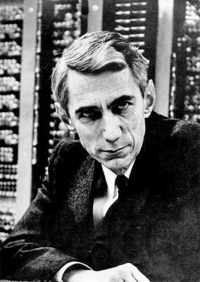
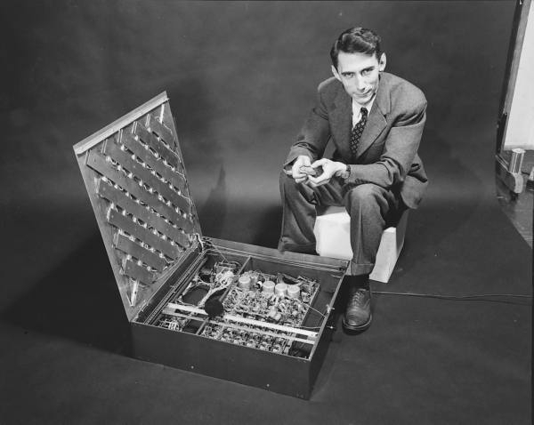

# Claude Shannon: O Pai da Teoria da Informação 📡

## 🎯 Quem foi Claude Shannon?

**Claude Elwood Shannon** (1916-2001) foi um matemático, engenheiro elétrico e criptógrafo americano, conhecido como o "pai da teoria da informação". Suas contribuições fundamentais estabeleceram as bases matemáticas para a comunicação digital e a revolução da tecnologia da informação.

---

## 📚 Linha do Tempo

### 🎓 Educação e Primeiros Anos
- **1916**: Nasceu em Petoskey, Michigan
- **1936**: Bacharelado em Matemática e Engenharia Elétrica pela Universidade de Michigan
- **1937**: Mestrado no MIT com tese seminal sobre circuitos
- **1940**: PhD em Matemática no MIT

### 🔬 Carreira e Pesquisas
- **1941**: Trabalhou no Bell Labs durante a guerra
- **1948**: Publicou "A Mathematical Theory of Communication"
- **1956**: Ingressou no MIT como professor
- **1958**: Nomeado Professor Donner de Ciência

---

## 💡 Contribuições Revolucionárias

### 📊 Teoria da Informação
- **1948**: Publicação fundamental que criou o campo
- Introduziu os conceitos de bit, entropia e redundância
- Estabeleceu limites fundamentais para comunicação
- Criou a fórmula para capacidade de canal

### 🔌 Álgebra Booleana em Circuitos
- **1937**: Tese de mestrade revolucionária
- Demonstrou que álgebra booleana poderia ser aplicada a circuitos
- Estabeleceu fundamentos para design de computadores digitais
- Introduziu o conceito de "bit" como unidade fundamental

### 🤖 Inteligência Artificial e Aprendizado
- **1950**: Propôs que máquinas poderiam jogar xadrez
- Desenvolveu o primeiro mouse computadorizado
- Trabalhou em máquinas de aprendizado
- Previu muitas aplicações modernas de IA

### 🎮 Dispositivos Criativos
- **1950**: Construiu máquinas divertidas e educativas
- Desenvolveu "Theseus" - rato mecânico que resolvia labirintos
- Criou jogos de xadrez computadorizados
- Inventou dispositivos de malabarismo

*Diagramas originais de Shannon explicando a teoria da informação*

---

## 🏆 Reconhecimentos e Prêmios

| Reconhecimento | Ano | Significado |
|----------------|-----|-------------|
| **Medalha de Honra IEEE** | 1966 | Maior honraria do IEEE |
| **Prêmio Kyoto** | 1985 | Reconhecimento por contribuições globais |
| **National Medal of Science** | 1966 | Maior honra científica dos EUA |
| **Prêmio Harvey** | 1972 | Reconhecimento por conquistas notáveis |

---

## 🎯 Filosofia e Citações Inspiradoras

> "A informação é a resolução da incerteza."

> "Visualizo um tempo em que seremos para os robôs o que os cães são para os humanos, e eu estou torcendo pelas máquinas."

> "Eu sempre persegui meus interesses sem muita preocupação com valor financeiro ou valor para o mundo."

---

## 📚 Legado e Influência

### 🌐 Revolução Digital
- Fundamentos matemáticos para todas as comunicações digitais
- Base para compactação de dados (ZIP, MP3, JPEG)
- Fundamentos para redes de computadores e internet
- Princípios para criptografia moderna

### 🔬 Ciência da Computação
- Álgebra booleana aplicada ao design de circuitos
- Teoria de codificação para correção de erros
- Fundamentos para algoritmos de compressão
- Base para protocolos de comunicação

### 🎵 Aplicações Diversas
- Genética (sequenciamento de DNA)
- Linguística (análise de linguagem natural)
- Neurociência (transmissão neural)
- Economia (teoria da decisão)

---

## 🏛️ Influência e Aplicações Modernas

### 💻 Tecnologias Baseadas em Seu Trabalho
- **Internet**: Protocolos TCP/IP
- **Telecomunicações**: Celulares e Wi-Fi
- **Armazenamento**: HDs, SSDs e DVDs
- **Multimídia**: Streaming de áudio e vídeo

### 🔍 Pesquisa Contemporânea
- **Machine Learning**: Teoria da informação aplicada
- **Bioinformática**: Análise de sequências genéticas
- **Criptografia**: Segurança da informação
- **Processamento de Sinais**: Áudio e imagem digital

---

## 📖 Para Saber Mais

### 📚 Leitura Recomendada
- "A Mathematical Theory of Communication" - Claude Shannon
- "The Bit and the Pendulum" - Tom Siegfried
- "Claude Shannon: Father of the Information Age" - Jimmy Soni e Rob Goodman

### 🌐 Recursos Online
- [Shannon's 1952 Paper on Chess](https://ieeexplore.ieee.org/document/5392560)
- [Bell Labs Shannon Archive](https://www.bell-labs.com/about/recognition/2020-claude-shannon/)
- [MIT Shannon Tribute](https://www.mit.edu/~shannon/)

---

## 🎉 Conclusão

Claude Shannon foi um dos pensadores mais originais do século XX, cujas ideias fundamentaram a era da informação. Sua capacidade de conectar matemática abstrata com aplicações práticas criou as bases para o mundo digital em que vivemos hoje.

> "O problema fundamental da comunicação é reproduzir em um ponto, exata ou aproximadamente, uma mensagem selecionada em outro ponto."

---

*"O Arquiteto da Era da Informação" - 1916-2001* 📡💡🔢

---
*Última atualização: Dezembro 2024*

