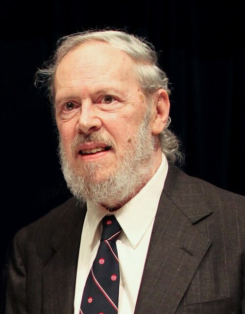
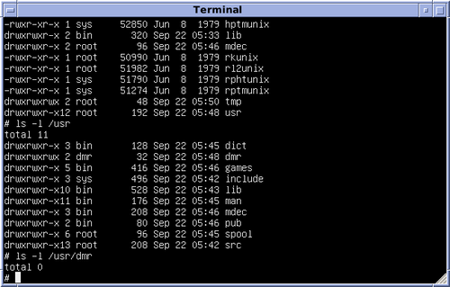

# Dennis Ritchie: O Arquitecto da Era Digital 💾

## 🖥️ Quem foi Dennis Ritchie?

**Dennis MacAlistair Ritchie** (1941-2011) foi um cientista da computação americano, mais conhecido por criar a linguagem de programação C e co-desenvolver o sistema operacional Unix. Suas contribuições fundamentais moldaram a computação moderna e estabeleceram as bases para a internet, sistemas operacionais e desenvolvimento de software.

---

## 📚 Linha do Tempo

### 🎓 Educação e Primeiros Anos
- **1941**: Nasceu em Bronxville, Nova York
- **1963**: Graduou-se em Física pela Harvard University
- **1967**: Entrou para os Bell Labs
- **1968**: Obteve PhD em Matemática Aplicada em Harvard

### 🔬 Carreira nos Bell Labs
- **1969**: Começou a trabalhar no projeto Unix com Ken Thompson
- **1971**: Primeira versão do Unix
- **1973**: Desenvolveu a linguagem C com Ken Thompson
- **1978**: Publicou "The C Programming Language" com Brian Kernighan

---

## 💡 Contribuições Revolucionárias

### 💬 Linguagem de Programação C
- **1972**: Desenvolvimento da linguagem C
- Combina poder de baixo nível com sintaxe de alto nível
- Tornou-se padrão para desenvolvimento de sistemas
- Influenciou praticamente todas as linguagens modernas

### 🐧 Sistema Operacional Unix
- **1969**: Co-desenvolvimento do Unix com Ken Thompson
- Primeiro sistema operacional escrito em linguagem de alto nível
- Introduziu conceitos revolucionários como pipes e shell
- Filosofia "fazer uma coisa e fazer bem"

### 📖 "The C Programming Language"
- **1978**: Livro com Brian Kernighan (conhecido como "K&R")
- Tornou-se a bíblia dos programadores C
- Estilo de escrita claro e conciso
- Exemplos que se tornaram padrão na indústria

### 🌐 Fundamentos para Tecnologias Modernas
- Unix → Linux, macOS, Android
- C → C++, Java, Python, JavaScript
- Princípios de design que permeiam a computação moderna
- Cultura de software livre e open source

---

## 🏆 Reconhecimentos e Prêmios

| Reconhecimento | Ano | Significado |
|----------------|-----|-------------|
| **Prêmio Turing** | 1983 | Com Ken Thompson por Unix e C |
| **Medalha IEEE Richard W. Hamming** | 1990 | Contribuições em ciência da computação |
| **National Medal of Technology** | 1999 | Com Ken Thompson por Unix e C |
| **Japan Prize** | 2011 | Por contribuições à tecnologia da informação |

---

## 📚 Legado e Influência

### 💻 Ecossistema de Tecnologias
- **Sistemas Operacionais**: Linux, macOS, iOS, Android
- **Linguagens**: C++, Java, C#, Python, JavaScript
- **Servidores**: 90% da internet roda em sistemas Unix-like
- **Dispositivos Embarcados**: Desde microcontroladores a supercomputadores

### 🔧 Princípios de Design
- "Keep it simple, stupid" (KISS)
- Modularidade e composição
- Texto como interface universal
- Ferramentas que fazem uma coisa bem

### 🌍 Impacto Global
- Internet construída sobre pilares Unix e C
- Cultura de código aberto e colaboração
- Educação em ciência da computação
- Padrões de interoperabilidade

---

## 🏛️ Influência em Tecnologias Modernas

### 📱 Sistemas Baseados em Seu Trabalho
- **Linux**: Kernel escrito em C, filosofia Unix
- **macOS**: Derivado do Unix BSD
- **Android**: Kernel Linux, ferramentas Unix
- **Internet**: Servidores web, DNS, email baseados em Unix

### 🔬 Desenvolvimento Contínuo
- **Padrão POSIX**: Padronização de interfaces Unix
- **Compiladores GCC, Clang**: Escritos em C
- **Sistemas Embarcados**: Dominados por C
- **Kernels Modernos**: Linux, Windows NT (partes em C)

---

*"O Pai da Computação Moderna" - 1941-2011* 💻🔧📚

