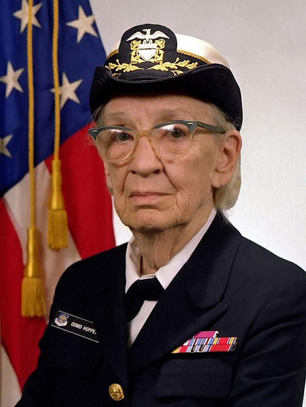
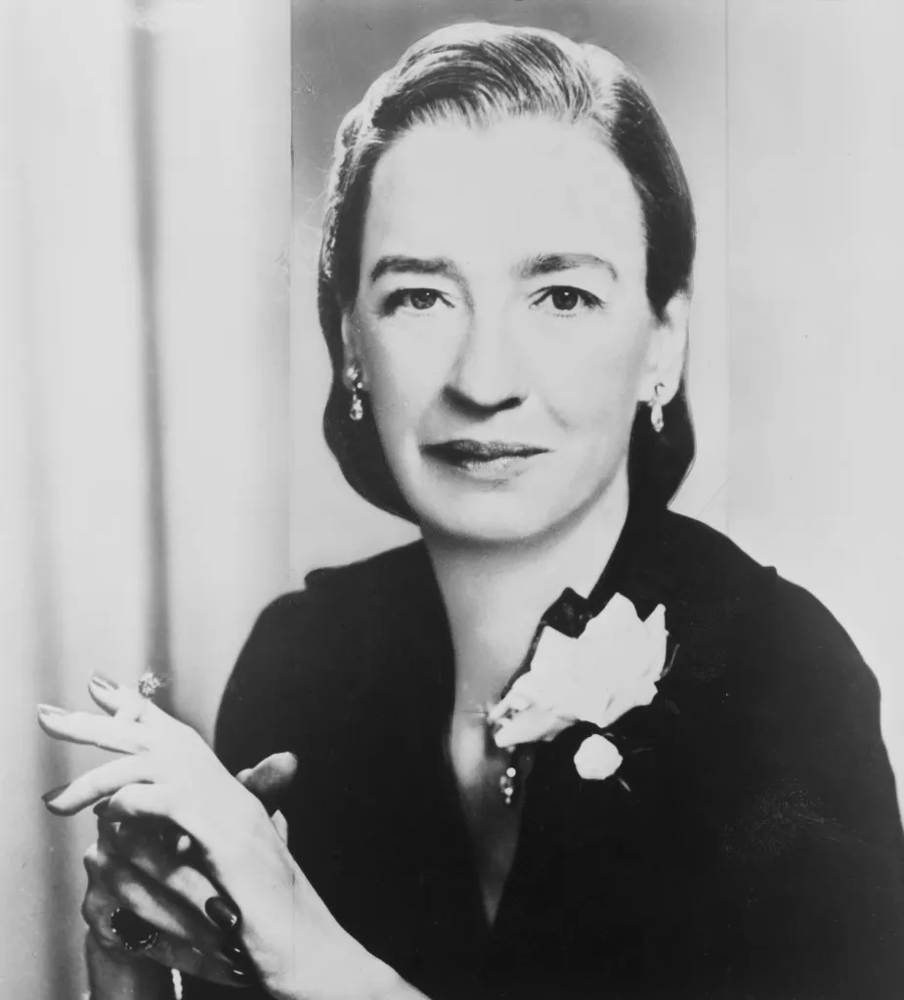
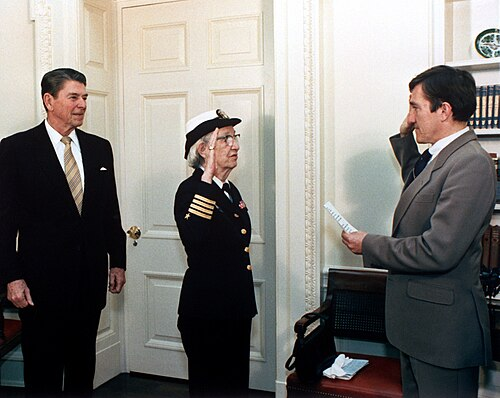
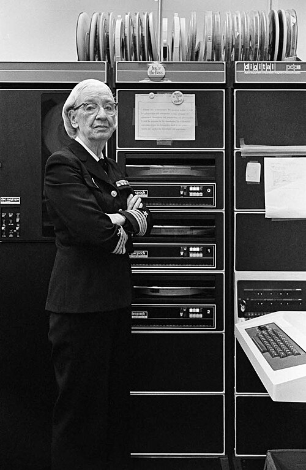

# Grace Hopper: A Pioneira da Computação 🚀

## 🎖️ Quem foi Grace Hopper?

**Grace Murray Hopper** (1906-1992) foi uma cientista da computação visionária e almirante da Marinha dos Estados Unidos que revolucionou o mundo da tecnologia. Conhecida carinhosamente como "Amazing Grace", ela foi uma das primeiras programadoras do computador Harvard Mark I e criadora da linguagem de programação COBOL.

---

## 📚 Linha do Tempo

### 🎓 Educação e Primeiros Anos
- **1906**: Nasceu em Nova York
- **1928**: Graduou-se em Matemática e Física no Vassar College
- **1930**: Mestrado na Universidade de Yale
- **1934**: Doutorado em Matemática em Yale

### ⚓ Carreira Naval
- **1943**: Alistou-se na Marinha durante a Segunda Guerra Mundial
- **1944**: Tornou-se uma das primeiras programadoras do Harvard Mark I
- **1949**: Entrou para a Eckert-Mauchly Computer Corporation
- **1983**: Promovida a Comodora
- **1985**: Primeira mulher a alcançar o posto de Almirante

---

## 💡 Contribuições Revolucionárias

### 🔧 Harvard Mark I
- Uma das primeiras programadoras do primeiro computador digital em larga escala
- Desenvolveu o primeiro manual de operações para computadores

### 🔄 O Primeiro Compilador
- **1952**: Desenvolveu o primeiro compilador (A-0 System)
- Revolucionou a programação ao permitir que códigos em linguagem humana fossem traduzidos para linguagem de máquina

### 💬 Linguagem COBOL
- **1959**: Liderou o desenvolvimento do COBOL (Common Business-Oriented Language)
- Primeira linguagem de programação de alto nível para negócios
- Ainda utilizada em sistemas legados até hoje

### 🐛 A Origem do "Bug"
- Popularizou o termo "debugging" após remover uma mariposa presa no Harvard Mark II

*O primeiro "bug" de computador - uma mariposa encontrada em 1947*

---

## 🏆 Prêmios e Reconhecimentos

| Prêmio | Ano | Contribuição |
|--------|-----|--------------|
| **Man of the Year** | 1969 | Data Processing Management Association |
| **National Medal of Technology** | 1991 | Contribuições à computação |
| **Presidential Medal of Freedom** | 2016 | Póstumo |
| **Destroyer USS Hopper** | 1997 | Navio batizado em sua homenagem |

---

---

