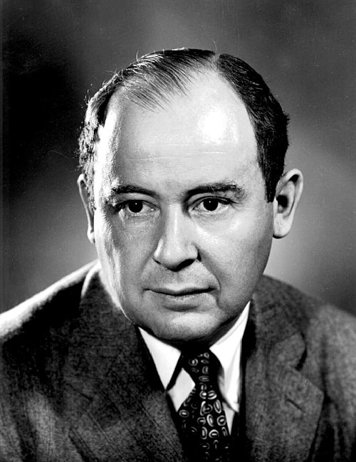
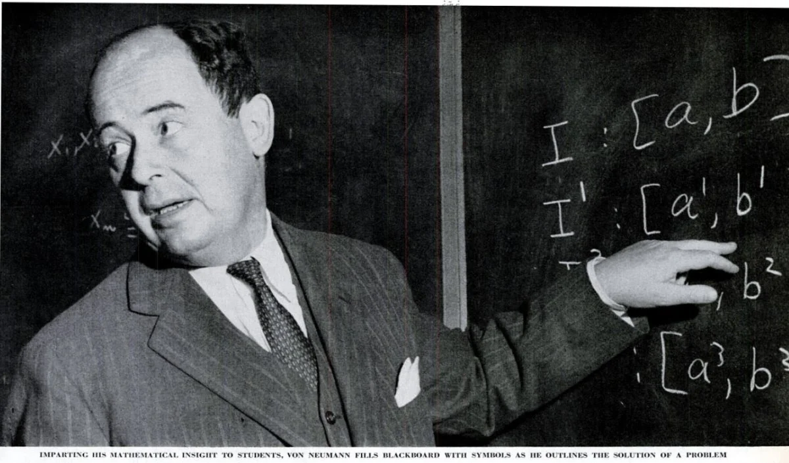
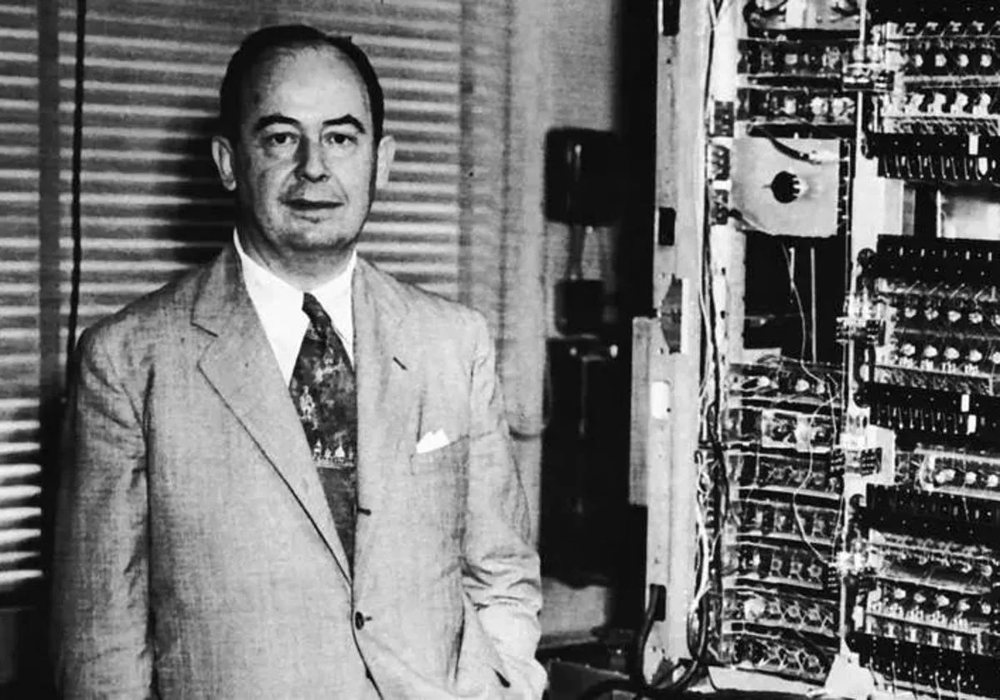

# John von Neumann: O Gênio Universal 🧮

## 🎓 Quem foi John von Neumann?

**John von Neumann** (1903-1957) foi um matemático húngaro-americano, físico, cientista da computação, engenheiro e polímata que fez contribuições fundamentais em diversas áreas. Conhecido como "o último dos grandes matemáticos", sua arquitetura de computadores revolucionou a tecnologia digital e estabeleceu os fundamentos da computação moderna.

---

## 📚 Linha do Tempo

### 🎓 Educação e Primeiros Anos
- **1903**: Nasceu em Budapeste, Hungria
- **1926**: Doutorado em Matemática pela Universidade de Budapeste
- **1926**: Pós-doutorado em Göttingen com David Hilbert
- **1930**: Emigrou para os Estados Unidos

### 🔬 Carreira e Realizações
- **1933**: Professor no Institute for Advanced Study, Princeton
- **1943**: Trabalhou no Projeto Manhattan
- **1945**: Publicou a Arquitetura de von Neumann
- **1954**: Nomeado para a Comissão de Energia Atômica

---

## 💡 Contribuições Revolucionárias

### 💻 Arquitetura de von Neumann
- **1945**: Primeiro Draft sobre EDVAC
- Conceito de programa armazenado
- Arquitetura unificada de CPU, memória e I/O
- Base para todos os computadores modernos

### 🎯 Teoria dos Jogos
- **1944**: "Theory of Games and Economic Behavior" com Oskar Morgenstern
- Fundamentos matemáticos para economia
- Conceitos de minimax e estratégias mistas
- Aplicações em economia, política e biologia

### ⚛️ Mecânica Quântica
- **1932**: "Mathematical Foundations of Quantum Mechanics"
- Formulação matemática rigorosa
- Operadores lineares em espaços de Hilbert
- Fundamentos para computação quântica

### 🔢 Análise Numérica
- Métodos numéricos para computação científica
- Desenvolvimento do método de Monte Carlo
- Aplicações em física e engenharia
- Otimização de algoritmos computacionais

---

## 🏆 Reconhecimentos e Prêmios

| Reconhecimento | Ano | Significado |
|----------------|-----|-------------|
| **Prêmio Enrico Fermi** | 1956 | Por contribuições à energia atômica |
| **Medalha Presidencial da Liberdade** | 1956 | Póstuma por serviços durante a guerra |
| **Membro da Royal Society** | 1945 | Reconhecimento internacional |
| **Prêmio Bôcher Memorial** | 1938 | Por trabalhos em análise matemática |

---

*"O Último Matemático Universal" - 1903-1957* 🧠⚛️💻

