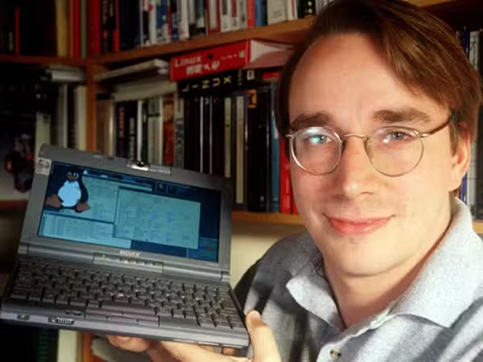
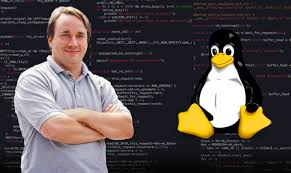

# Linus Torvalds: O Pai do Linux 🐧

## 🐧 Quem é Linus Torvalds?

**Linus Benedict Torvalds** (1969-presente) é um engenheiro de software finlandês-americano, criador do kernel Linux e do sistema de controle de versão Git. Suas contribuições revolucionaram o mundo do software livre e open source, criando as bases para a internet moderna e a computação em nuvem.

---

## 📚 Linha do Tempo

### 🎓 Educação e Primeiros Anos
- **1969**: Nasceu em Helsinki, Finlândia
- **1988**: Entrou na Universidade de Helsinki
- **1990**: Começou estudos em Ciência da Computação
- **1996**: Mestrado em Ciência da Computação

### 🚀 Desenvolvimento do Linux
- **1991**: Anunciou o projeto Linux em comp.os.minix
- **1994**: Lançamento do Linux 1.0
- **1997**: Começou a trabalhar na Transmeta Corporation
- **2003**: Iniciou desenvolvimento do Git
- **2005**: Lançamento do Git

---

## 💡 Contribuições Revolucionárias

### 🐧 Kernel Linux
- **1991**: Desenvolvimento iniciado como um hobby
- Kernel monolítico modular e portável
- Suporte a múltiplas arquiteturas de hardware
- Licença GPL que garantiu liberdade e colaboração

### 🔧 Sistema de Controle de Versão Git
- **2005**: Criado para substituir BitKeeper no desenvolvimento do Linux
- Sistema distribuído e altamente eficiente
- Revolucionou o desenvolvimento colaborativo
- Padrão da indústria para controle de versão

### 🌍 Movimento Open Source
- Modelo de desenvolvimento colaborativo descentralizado
- Filosofia "release early, release often"
- Manutenção da visão técnica do projeto
- Rejeição a "design by committee"

### 💼 Carreira e Liderança
- **2003**: Tornou-se fellow da Linux Foundation
- Mantenedor final do kernel Linux
- Liderança técnica sem interferência corporativa
- Defesa da qualidade técnica sobre interesses comerciais

---

## 🏆 Reconhecimentos e Prêmios

| Reconhecimento | Ano | Significado |
|----------------|-----|-------------|
| **Prêmio Millennium Technology** | 2012 | Maior prêmio de tecnologia da Finlândia |
| **Internet Hall of Fame** | 2012 | Por contribuições fundamentais à internet |
| **IEEE Computer Pioneer Award** | 2014 | Por criação do Linux |
| **Prêmio de Inovação** | 2018 | IEEE Masaru Ibuka |

---

*"O Pai do Open Source Moderno" - 1969-presente* 🐧🔧🌍

