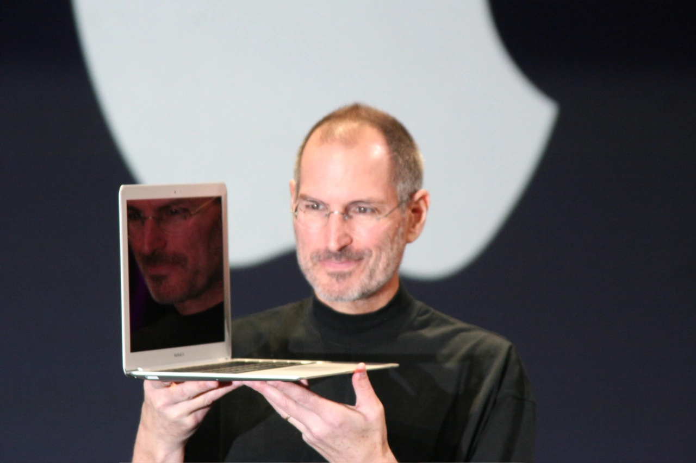

# Steve Jobs: O Visionário da Tecnologia que Encanta 🍎

## 🍎 Quem foi Steve Jobs?

**Steven Paul Jobs** (1955-2011) foi um visionário, inventor e empresário americano que co-fundou a Apple Inc. e revolucionou múltiplas indústrias, incluindo computação pessoal, música, telefonia e animação digital. Sua obsessão por design, simplicidade e experiência do usuário redefiniu o papel da tecnologia no cotidiano das pessoas.

---

## 📚 Linha do Tempo

### 🎓 Educação e Primeiros Anos
- **1955**: Nasceu em San Francisco, Califórnia
- **1972**: Entrou no Reed College (largou após 6 meses)
- **1974**: Trabalhou na Atari como técnico
- **1974**: Viajou para a Índia em busca de iluminação espiritual

### 🚀 Carreira e Realizações
- **1976**: Fundou a Apple com Steve Wozniak e Ronald Wayne
- **1984**: Lançamento do Macintosh
- **1985**: Deixou a Apple e fundou a NeXT
- **1986**: Comprou a Pixar da Lucasfilm
- **1997**: Retornou à Apple como CEO
- **2011**: Faleceu devido a câncer pancreático

---

## 💡 Contribuições Revolucionárias

### 💻 Apple I e Apple II
- **1976**: Apple I - um dos primeiros computadores pessoais
- **1977**: Apple II - primeiro computador pessoal de sucesso em massa
- Estabeleceu padrões para indústria de computadores domésticos
- Combinou hardware e software de forma integrada

### 🖥️ Macintosh
- **1984**: Lançamento com famoso comercial do Super Bowl
- Primeiro computador com interface gráfica acessível ao público
- Popularizou o mouse e a metáfora da mesa de trabalho
- "O computador para o resto de nós"

### 🎬 Pixar Animation Studios
- **1986-2006**: Transformou a Pixar em líder em animação digital
- **1995**: "Toy Story" - primeiro longa-metragem totalmente em CGI
- Revolucionou a indústria do entretenimento
- Demonstrou o poder da tecnologia na criatividade

### 📱 Produtos que Mudaram Indústrias
- **2001**: iPod - revolucionou a indústria musical
- **2007**: iPhone - redefiniu os smartphones
- **2010**: iPad - criou o mercado de tablets
- **2001**: Apple Stores - novo conceito em varejo

---

## 🏆 Reconhecimentos e Prêmios

| Reconhecimento | Ano | Significado |
|----------------|-----|-------------|
| **National Medal of Technology** | 1985 | Com Steve Wozniak por contribuições à tecnologia |
| **Disney Board of Directors** | 2006 | Após aquisição da Pixar pela Disney |
| **Grammy Trustees Award** | 2012 | Póstumo por contribuições à música digital |
| **Fortune Businessperson** | 2007, 2008, 2009, 2010 | Reconhecimento por liderança empresarial |

*"O Visionário que Pensava Diferente" - 1955-2011* 🍎💡🚀

